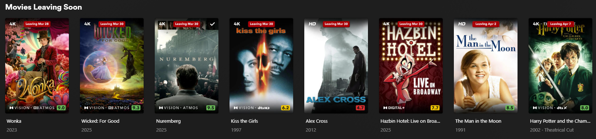
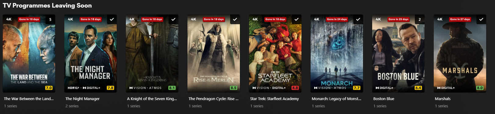

<p align="center">
  
    <br>
</p>

<p align="center" >
  <br>
<!-- Discord Badge -->  <a href="https://discord.gg/WP4ZW2QYwk"></a>
<!-- Latest Build -->  <picture></picture>
<!-- Latest Release -->  <a href="https://github.com/mrlinford/maintainerr-v3-overlay-helperr/releases"></a>
<!-- Commits -->  <picture></picture>
<!-- Github Stars -->  <picture></picture>
<!--Commits per month -->  <picture></picture>
<!-- Issues Closed -->  <picture></picture>
<!-- Issues Open -->  <picture></picture>
<!-- License -->  <picture></picture>
</p>

# Maintainerr v3 Overlay Helperr

**Project inspired by [Maintainerr Poster Overlay](https://gitlab.com/jakeC207/maintainerr-poster-overlay)**

**Original work and Forked from [gssariev/maintainerr-overlay-helperr](https://github.com/gssariev/maintainerr-overlay-helperr)**

This project is a helper script that works with [Maintainerr](https://github.com/jorenn92/Maintainerr) to add a Netflix-style "leaving soon" overlay on top of your media. It integrates with Plex and Maintainerr to download posters, add overlay text, and upload the modified posters back to Plex. It runs periodically to ensure posters are updated with the correct information.

### Preview

#### Using Calculated Date



#### Using Days Left



## Features

- **Collections**: All types of collections are supported. The script can process multiple collections at once and reorder each Plex collection in ascending or descending order based on deletion date, allowing you to easily manage upcoming removals.
- **Customizable overlay**: use custom text, colour, size, shape & positioning of the overlay
- **Overlay reset & deletion**: revert to the original poster & delete the generated overlay poster from the Plex metadata folder
- **Automatic poster update**: The overlay's deletion date automatically updates to match any modifications you make to Maintainerr rules, ensuring your visual overlays always reflect the latest media removal schedules.
- **Display days left vs exact date**: choose between showing the calculated date of removal (Netflix style) or days leading up to it (countdown)
- **CRON scheduling**: schedule when the script should run using CRON expressions

## Requirements

- [Docker](https://www.docker.com/get-started/)
- [Plex Media Server](https://github.com/linuxserver/docker-plex)
- [Maintainerr](https://github.com/Maintainerr/Maintainerr)

## Usage

#### Docker run:

```Yaml
docker run -d \
  --name='maintainerr-v3-overlay-helperr' \
  -e TZ="Europe/London" \
  -e 'PLEX_URL'='http://192.168.1.225:32400' \
  -e 'PLEX_TOKEN'='PLEX TOKEN' \
  -e 'MAINTAINERR_URL'='http://192.168.1.225:6246' \
  -e 'FONT_COLOR'='#FFFFFF' \
  -e 'FONT_SIZE'='3.2' \
  -e 'BACK_COLOR'='#B20710' \
  -e 'PADDING'='1.2' \
  -e 'BACK_RADIUS'='0' \
  -e 'HORIZONTAL_OFFSET'='0' \
  -e 'VERTICAL_OFFSET'='3' \
  -e 'HORIZONTAL_ALIGN'='center' \
  -e 'VERTICAL_ALIGN'='top' \
  -e 'RESET_OVERLAY'='false' \
  -e 'REAPPLY_OVERLAY'='true' \
  -e 'DATE_FORMAT'='MMM d' \
  -e 'ENABLE_DAY_SUFFIX'='false' \
  -e 'USE_DAYS'='true' \
  -e 'ENABLE_UPPERCASE'='false' \
  -e 'OVERLAY_TEXT'='Leaving' \
  -e 'TEXT_TODAY'='Last chance to watch' \
  -e 'TEXT_DAY'='Gone tomorrow' \
  -e 'TEXT_DAYS'='Gone in {0} days' \
  -e 'PLEX_COLLECTION_ORDER'='asc' \
  -e 'PROCESS_COLLECTIONS'='Movies Leaving Soon, TV Programmes Leaving Soon' \
  -e 'LANGUAGE'='en-GB' \
  -e 'CRON_SCHEDULE'='0 8 * * *' \
  -e 'RUN_ON_CREATION'='true' \
  -e 'IMAGE_SAVE_PATH'='/images' \
  -e 'ORIGINAL_IMAGE_PATH'='/images/originals' \
  -e 'TEMP_IMAGE_PATH'='/images/temp' \
  -e 'FONT_PATH'='/fonts/font.ttf' \
  -e 'PUID'='99' \
  -e 'PGID'='100' \
  -e 'UMASK'='022' \
  -v '/mnt/cache/appdata/maintainerr_overlay_helperr/images':'/images':'rw' \
  -v '/mnt/cache/appdata/maintainerr_overlay_helperr/fonts':'/fonts':'rw' \
  -v '/mnt/cache/appdata/plex/Library/Application Support/Plex Media Server/Metadata/':'/plexmeta':'rw' \
  'ghcr.io/mrlinford/maintainerr-v3-overlay-helperr:latest'
```

#### Docker-compose:

```Yaml
version: "3.8"

services:
  maintainerr-v3-overlay-helperr:
    image: ghcr.io/mrlinford/maintainerr-v3-overlay-helperr:latest
    container_name: maintainerr-overlay-helperr
    environment:
      # --- Connection Settings ---
      PLEX_URL: "http://192.168.1.225:32400"
      PLEX_TOKEN: "PLEX TOKEN"
      MAINTAINERR_URL: "http://192.168.1.225:6246"
      TZ: "Europe/London"

      # --- Permissions & Security ---
      PUID: 99  # Runs as 'nobody' for enhanced security
      PGID: 100 
      UMASK: 022 # Controls default permissions for created files

      # --- Logic & Scheduling ---
      RUN_ON_CREATION: "true"
      CRON_SCHEDULE: "0 */8 * * *" # Managed by Supercronic for better reliability
      REAPPLY_OVERLAY: "false"
      RESET_OVERLAY: "false"
      USE_DAYS: "true"

      # --- Path Configuration ---
      IMAGE_SAVE_PATH: "/images"
      ORIGINAL_IMAGE_PATH: "/images/originals"
      TEMP_IMAGE_PATH: "/images/temp"
      FONT_PATH: "/fonts/AvenirNextLTPro-Bold.ttf"

      # --- Visual Customization ---
      FONT_COLOR: "#ffffff"
      BACK_COLOR: "#B20710"
      FONT_SIZE: "3.2"
      PADDING: "1.2"
      BACK_RADIUS: "0"
      HORIZONTAL_OFFSET: "0"
      HORIZONTAL_ALIGN: "center"
      VERTICAL_OFFSET: "3"
      VERTICAL_ALIGN: "top"

      # --- Localization & Text ---
      DATE_FORMAT: "MMM d"
      OVERLAY_TEXT: "Leaving"
      TEXT_TODAY: "Last chance to watch"
      TEXT_DAY: "Gone tomorrow"
      TEXT_DAYS: "Gone in {0} days"
      ENABLE_DAY_SUFFIX: "true"
      ENABLE_UPPERCASE: "false"
      LANGUAGE: "en-GB"

      # --- Collection Management ---
      PLEX_COLLECTION_ORDER: "asc"
      PROCESS_COLLECTIONS: "Movies Leaving Soon, TV Programmes Leaving Soon"

    volumes:
      - /mnt/cache/appdata/maintainerr_overlay_helperr/images:/images
      - /mnt/cache/appdata/maintainerr_overlay_helperr/fonts:/fonts
      - /mnt/cache/appdata/plex/Library/Application Support/Plex Media Server/Metadata/:/plexmeta
```

#### Unraid

Orginal Maintainerr-Overlay-Helperr community app available thanks to [nwithan8](https://github.com/nwithan8/unraid_templates)

[Unraid Template](https://github.com/MrLinford/maintainerr-v3-overlay-helperr/main/templates/maintainerr-v3-overlay-helperr.xml)

#### Ensure Directories Exist

- Ensure the directories specified in IMAGE_SAVE_PATH, ORIGINAL_IMAGE_PATH, and TEMP_IMAGE_PATH exist on your system.
- Ensure that the font file you are going to use is present in the mapped 'fonts' folder prior to running the script.
- The script will automatically run every RUN_INTERVAL minutes. If the interval is not specified, it defaults to 8 hours.
